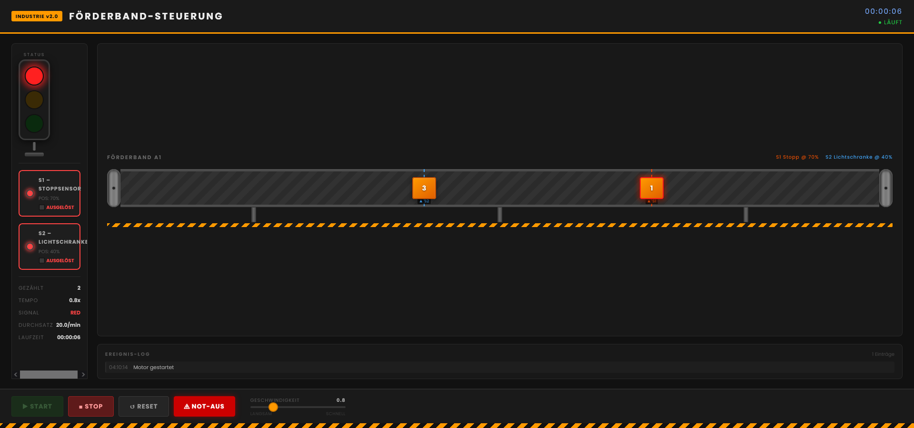
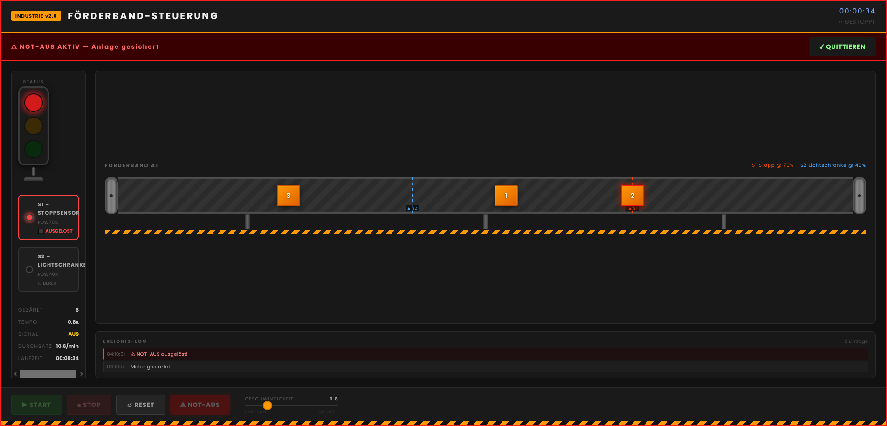

# Förderband-Steuerung

An interactive industrial conveyor belt simulation built with React. Control items moving on a conveyor system with real-time monitoring, sensors, and traffic light indicators.

## Features

- Real-time item tracking on animated conveyor belt
- Dual sensor system: Stop sensor (S1) and optical sensor (S2)
- Traffic light status indicator with LED simulation
- Event logging with fault detection and jam alerts
- Piece counter and throughput calculation
- Emergency stop (E-Stop) functionality with safety lock
- Adjustable speed control
- Professional industrial UI with Poppins font

## Overview





## Getting Started

Install dependencies:
```
npm install
```

Start development server:
```
npm run dev
```

## Technology

- React 19
- CSS3 with custom styling
- Poppins font family
- Pure CSS animations (no Tailwind)

## Controls

- START: Begin conveyor operation
- STOP: Pause all movement
- RESET: Clear counter and logs
- E-STOP: Emergency shutdown
- Speed Slider: Adjust conveyor speed (0.2x to 3.0x)

## Sensors

- S1 (Stop Sensor): Stops items at 70% for 1.5 seconds, triggers red light
- S2 (Optical Sensor): Detects items at 40%, triggers indicator without stopping

## License

MIT
